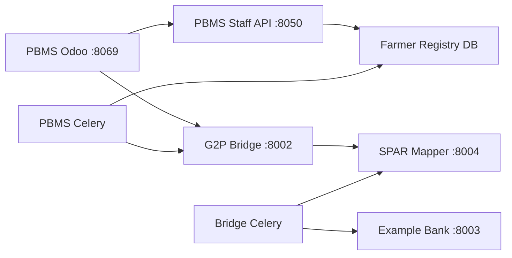

# PBMS + SPAR + G2P Bridge — full disbursement stack

## Goal

Run eligibility through disbursement locally:

**Registry** (beneficiary IDs) → **PBMS** (lists + entitlements) → **SPAR** (ID → bank account) → **G2P Bridge** (mapper resolution + bank ops) → **Example bank** (simulator).

Monorepos: [OpenG2P/pbms](https://github.com/OpenG2P/pbms), [OpenG2P/spar](https://github.com/OpenG2P/spar), [OpenG2P/g2p-bridge](https://github.com/OpenG2P/g2p-bridge).

## Architecture (local)



Per [OpenG2P SPAR docs](https://docs.openg2p.org/products/spar/features/spar-mapper), PBMS produces beneficiary IDs; **G2P Bridge** resolves each ID to a financial address via **SPAR Mapper** before paying through the sponsor bank.

## One-time setup

```bash
cp .env.example .env
make pbms-full-setup
```

This runs `pbms-setup`, clones/installs SPAR + Bridge, migrates `spardb` / `g2pbridgedb` / `examplebankdb`, and seeds SPAR links from `g2p_register_farmers.internal_record_id`.

## Daily run

```bash
make pbms-run
```

`PBMS_WITH_SPAR=true` and `PBMS_WITH_BRIDGE=true` (default in `.env.example`) start SPAR and Bridge before PBMS bg tasks and Odoo.

## URLs

| Service | Port | URL |
|---------|------|-----|
| Odoo PBMS | 8069 | http://localhost:8069 |
| PBMS Staff API | 8050 | http://localhost:8050/docs |
| G2P Bridge partner API | 8002 | http://localhost:8002/docs |
| Example bank | 8003 | http://localhost:8003/docs |
| SPAR mapper | 8004 | http://localhost:8004/docs |
| SPAR bene portal | 8005 | http://localhost:8005/docs |
| Farmer registry API | 8001 | http://localhost:8001/docs |

## Odoo settings (auto-set by `make pbms-run`)

| Setting | Value |
|---------|-------|
| Staff Portal API URL | `http://localhost:8050` |
| G2P Bridge Partner API URL | `http://localhost:8002` |

## Beneficiary ID alignment (critical)

| System | ID used |
|--------|---------|
| Farmer registry | `g2p_register_farmers.internal_record_id` (UUID) |
| PBMS eligibility / disbursement | same UUID as `registrant_id` / `beneficiary_id` |
| SPAR `id_fa_mappings.id_value` | same UUID |
| Bridge `mapper_resolution_worker` | resolves `disbursement.beneficiary_id` via SPAR |

Re-seed SPAR links after a fresh registry seed:

```bash
make seed-spar-farmer-links
```

Account numbers are derived from `functional_record_id` (e.g. `FR-0001` → `FR0001`) with bank code `EXAMPLE-BANK`, matching the [G2P Bridge example bank](https://github.com/OpenG2P/g2p-bridge) simulator.

## Background tasks

| Component | Celery beat tasks |
|-----------|-------------------|
| PBMS | `beneficiary_list_worker`, entitlement/disbursement envelope workers |
| G2P Bridge | `mapper_resolution_beat_producer`, `check_funds_with_bank`, `block_funds_with_bank`, `disburse_funds_from_bank`, … ([Bridge design spec](https://docs.openg2p.org/products/g2p-bridge/design-specifications)) |

Redis DB isolation (default):

| Redis DB | Consumer |
|----------|----------|
| 0 | Registry Celery |
| 1 | PBMS Celery |
| 2 | G2P Bridge Celery |
| 3 | Example bank Celery |

## Manual steps

```bash
make clone PROFILE=pbms
make clone PROFILE=spar
make clone PROFILE=bridge
make install-spar && make init-spar && make seed-spar-farmer-links
make install-bridge && make init-bridge
make pbms-run
```

## Disbursement test flow (Odoo)

1. Complete eligibility on a beneficiary list (PBMS Celery → `bgtaskdb`).
2. Run entitlement → approve disbursement list.
3. PBMS sends disbursement envelope to Bridge (`G2P_BRIDGE_BASE_URL=http://localhost:8002`).
4. Bridge Celery runs **mapper resolution** against SPAR, then check/block/disburse via example bank.

See [PBMS disbursement workflow](https://docs.openg2p.org/products/pbms/design/disbursement-workflow).

## Databases

| DB | Purpose |
|----|---------|
| `pbmsdb` | Odoo |
| `bgtaskdb` | PBMS bg-task state |
| `farmer_registry_db` | Registry + `g2p_register_farmer` view |
| `spardb` | SPAR ID→FA mappings |
| `g2pbridgedb` | Bridge disbursements |
| `examplebankdb` | Example bank simulator |

## Troubleshooting

```bash
bash scripts/free-bridge-spar-ports.sh   # free Bridge/SPAR ports
make seed-spar-farmer-links              # refresh ID→bank links
make init-bridge                         # re-migrate bridge DBs
```

If mapper resolution fails, confirm SPAR has a link for the beneficiary UUID:

```bash
PGPASSWORD=password psql -h localhost -p 5433 -U sparuser -d spardb \
  -c "SELECT id_value, left(fa_value,80) FROM id_fa_mappings LIMIT 5;"
```
